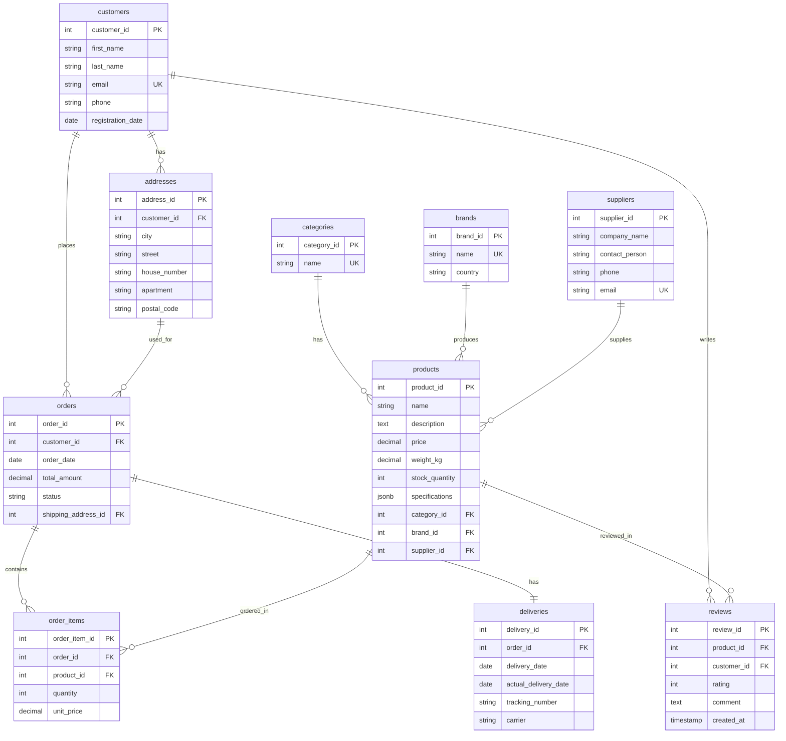

# ER-диаграмма базы данных интернет-магазина "ProteinPower"

## Описание схемы базы данных

База данных состоит из 10 основных таблиц, связанных между собой через внешние ключи.

### Структура таблиц и связей

#### 1. **categories** (Категории товаров)
- `category_id` (PK) - Уникальный идентификатор категории
- `name` - Название категории (UNIQUE)

**Связи:**
- Один-ко-многим с `products`

#### 2. **brands** (Бренды)
- `brand_id` (PK) - Уникальный идентификатор бренда
- `name` - Название бренда (UNIQUE)
- `country` - Страна-производитель

**Связи:**
- Один-ко-многим с `products`

#### 3. **suppliers** (Поставщики)
- `supplier_id` (PK) - Уникальный идентификатор поставщика
- `company_name` - Название компании
- `contact_person` - Контактное лицо
- `phone` - Телефон
- `email` - Email (UNIQUE)

**Связи:**
- Один-ко-многим с `products`

#### 4. **products** (Товары)
- `product_id` (PK) - Уникальный идентификатор товара
- `name` - Название товара
- `description` - Описание товара
- `price` - Цена (CHECK: > 0)
- `weight_kg` - Вес упаковки (CHECK: > 0)
- `stock_quantity` - Остаток на складе (DEFAULT: 0, CHECK: >= 0)
- `category_id` (FK → categories)
- `brand_id` (FK → brands)
- `supplier_id` (FK → suppliers)
- `specifications` (JSONB) - Дополнительные характеристики

**Связи:**
- Многие-к-одному с `categories`
- Многие-к-одному с `brands`
- Многие-к-одному с `suppliers`
- Один-ко-многим с `order_items`
- Один-ко-многим с `reviews`

#### 5. **customers** (Клиенты)
- `customer_id` (PK) - Уникальный идентификатор клиента
- `first_name` - Имя
- `last_name` - Фамилия
- `email` - Email (UNIQUE)
- `phone` - Телефон
- `registration_date` - Дата регистрации (DEFAULT: CURRENT_DATE)

**Связи:**
- Один-ко-многим с `addresses`
- Один-ко-многим с `orders`
- Один-ко-многим с `reviews`

#### 6. **addresses** (Адреса доставки)
- `address_id` (PK) - Уникальный идентификатор адреса
- `customer_id` (FK → customers)
- `city` - Город
- `street` - Улица
- `house_number` - Номер дома
- `apartment` - Квартира
- `postal_code` - Почтовый индекс

**Связи:**
- Многие-к-одному с `customers`
- Один-ко-многим с `orders`

#### 7. **orders** (Заказы)
- `order_id` (PK) - Уникальный идентификатор заказа
- `customer_id` (FK → customers)
- `order_date` - Дата заказа (DEFAULT: CURRENT_DATE)
- `total_amount` - Общая сумма (CHECK: >= 0)
- `status` - Статус заказа (CHECK: pending, processing, shipped, delivered, cancelled)
- `shipping_address_id` (FK → addresses)

**Связи:**
- Многие-к-одному с `customers`
- Многие-к-одному с `addresses`
- Один-ко-многим с `order_items`
- Один-к-одному с `deliveries`

#### 8. **order_items** (Позиции заказа)
- `order_item_id` (PK) - Уникальный идентификатор позиции заказа
- `order_id` (FK → orders)
- `product_id` (FK → products)
- `quantity` - Количество (CHECK: > 0)
- `unit_price` - Цена за единицу на момент заказа (CHECK: > 0)

**Связи:**
- Многие-к-одному с `orders`
- Многие-к-одному с `products`

#### 9. **deliveries** (Доставки)
- `delivery_id` (PK) - Уникальный идентификатор доставки
- `order_id` (FK → orders, UNIQUE)
- `delivery_date` - Планируемая дата доставки
- `actual_delivery_date` - Фактическая дата доставки
- `tracking_number` - Трек-номер
- `carrier` - Служба доставки

**Связи:**
- Один-к-одному с `orders`

#### 10. **reviews** (Отзывы)
- `review_id` (PK) - Уникальный идентификатор отзыва
- `product_id` (FK → products)
- `customer_id` (FK → customers)
- `rating` - Оценка (CHECK: 1-5)
- `comment` - Текст отзыва
- `created_at` - Дата создания (DEFAULT: CURRENT_TIMESTAMP)
- UNIQUE (product_id, customer_id)

**Связи:**
- Многие-к-одному с `products`
- Многие-к-одному с `customers`

## Диаграмма связей (Mermaid)

## Типы связей

1. **Один-ко-многим (1:N):**
   - categories → products
   - brands → products
   - suppliers → products
   - customers → addresses
   - customers → orders
   - customers → reviews
   - addresses → orders
   - orders → order_items
   - products → order_items
   - products → reviews

2. **Один-к-одному (1:1):**
   - orders → deliveries

## Ограничения целостности

### Primary Keys (PK)
- Все таблицы имеют первичный ключ

### Foreign Keys (FK)
- Все внешние ключи имеют ограничения ON DELETE (RESTRICT, CASCADE)

### Unique Constraints (UK)
- `categories.name`
- `brands.name`
- `suppliers.email`
- `customers.email`
- `deliveries.order_id`
- `reviews(product_id, customer_id)` - комбинация

### Check Constraints
- `products.price > 0`
- `products.weight_kg > 0`
- `products.stock_quantity >= 0`
- `orders.total_amount >= 0`
- `orders.status IN ('pending', 'processing', 'shipped', 'delivered', 'cancelled')`
- `order_items.quantity > 0`
- `order_items.unit_price > 0`
- `reviews.rating BETWEEN 1 AND 5`
- Email валидация для `customers.email` и `suppliers.email`

## Индексы

### Индексы для внешних ключей
- `idx_products_category_id`
- `idx_products_brand_id`
- `idx_products_supplier_id`
- `idx_addresses_customer_id`
- `idx_orders_customer_id`
- `idx_orders_shipping_address_id`
- `idx_order_items_order_id`
- `idx_order_items_product_id`
- `idx_deliveries_order_id`
- `idx_reviews_product_id`
- `idx_reviews_customer_id`

### Дополнительные индексы
- `idx_orders_status`
- `idx_orders_order_date`
- `idx_products_name`
- `idx_customers_email`
- `idx_customers_last_name`
- `idx_suppliers_email`
- `idx_products_specifications_gin` (GIN индекс для JSONB)
- Составные индексы для оптимизации запросов

## Примечания

1. Таблица `products` содержит JSONB колонку `specifications` для хранения дополнительных характеристик товаров в гибком формате.

2. Таблица `reviews` имеет ограничение UNIQUE на комбинацию `(product_id, customer_id)`, что позволяет одному клиенту оставить только один отзыв на товар.

3. Таблица `deliveries` имеет ограничение UNIQUE на `order_id`, что гарантирует одну доставку на заказ.

4. Триггеры автоматически обновляют остатки товаров при создании/изменении/удалении позиций заказа.

5. Триггеры автоматически пересчитывают общую сумму заказа при изменении позиций.

## Использование диаграммы

Для визуализации ER-диаграммы можно использовать:
- [Mermaid Live Editor](https://mermaid.live/)
- [dbdiagram.io](https://dbdiagram.io/)
- [Draw.io](https://app.diagrams.net/)
- Любые другие инструменты, поддерживающие Mermaid или создание ER-диаграмм

Для создания PNG изображения из Mermaid диаграммы:
1. Скопируйте код Mermaid из раздела выше
2. Вставьте в Mermaid Live Editor
3. Экспортируйте как PNG

